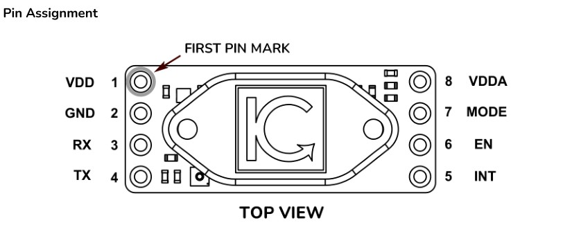

# Faraday-Ox Python Example

Python example on how to interact with FaradayOx sensor  over UART from the PC.
USB to UART connector is required.
Change port in the script to appropriate one  ```sensor = SensorDevice(port="COM15", baudrate=9600)```
For serial communication to work: ```pip install pyserial```

## NOTE
**In recent versions of modules it is required to connect VDD and VDDA**


 
